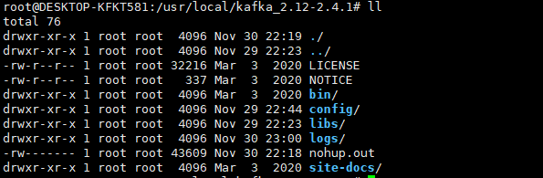
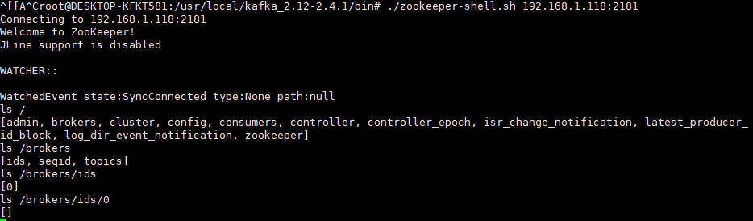
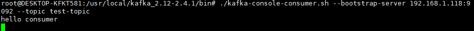
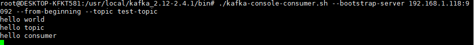

# 1、kafka安装与启动

## 1.1、kafka安装

[kafka下载地址]: https://kafka.apache.org/downloads

在以上地址下载kafka安装包，安装完成后传到环境上解压即可。如果没有安装jdk，需要先安装jdk。

 

解压完成后如下

 

## 1.2、kafka配置文件

kafka的配置文件为config/server.properties

主要关注以下配置

| 配置              | 说明                                                  |
| ----------------- | ----------------------------------------------------- |
| broker.id         | kafka服务的id，kafka集群模式下，该id必须唯一          |
| listeners         | kafka服务器监听的地址。PLAINTEXT://192.168.1.118:9092 |
| log.dirs          | kafka日志保持路径。默认为/tmp/kafka-logs              |
| num.partitions    | topic分区数量，默认为1。可通过创建topic时指定         |
| zookeeper.connect | zookeeper地址。                                       |

## 1.3、kafka启动与停止

进入解压目录下的bin目录下，执行以下命令

```shell
# 先启动zookeeper
nohup ./zookeeper-server-start.sh ../config/zookeeper.properties &
# 再启动kafka
./kafka-server-start.sh -daemon ../config/server.properties
# 停止先停止kafka，再停止zookeeper。
kill -9 ${pid}
```

附：

zookeeper与kafka全部启动完成后，可以进入zookeeper中查看kafka节点信息。

 

# 2、kafka基础

## 2.1、kafka中的相关术语

 

| 名称          | 说明                                                         |
| ------------- | ------------------------------------------------------------ |
| Broker        | Kafka集群中的一台或多台服务器统称broker.                     |
| Topic         | Kafka会依据topic对不同的消息进行分类。每条消息都需要指定一个topic |
| Producer      | 消息生产者，向Broker中发送消息的客户端                       |
| Consumer      | 消息消费者，向Broker中读取消息的客户端                       |
| ConsumerGroup | 消费者组，可以并行消费Topic中的partition的消息               |
| Partition     | Topic物理上的分组，一个topic可以分为多个partion,每个partion是一个有序的队列。partion中每条消息都会被分配一个有序的Id(offset) |

## 2.2、Topic

### 2.2.1、创建Topic

使用./kafka-topics.sh并指定以下参数

--create：创建

--zookeeper：指定zookeeper服务地址

--topic：topic名称

--topic：topic名称

--partitions 指定分区大小

--replication-factor 指定备份因子大小

```shell
# 创建topic
./kafka-topics.sh --zookeeper localhost:2181 --create --topic test-topic --partitions 1 --replication-factor 1
```

### 2.2.1、删除Topic

使用./kafka-topics.sh并指定以下参数

--delete：删除

--zookeeper：指定zookeeper服务地址

--topic：topic名称

```shell
# 1、topic删除
./kafka-topics.sh --zookeeper localhost:2181 --delete --topic test-topic 
# 2、topic所在日志目录删除
rm -rf /tmp/logs/kafka-logs/${topicName}
# 3、进入zookeeper客户端，删除zookeeper服务器上保存的topic信息
ls /brokers/topics
rmr /brokers/topics/test-topic
ls /brokers/topics
```

### 2.2.1、查看所有Topic

使用./kafka-topics.sh并指定以下参数

--list：查询

--zookeeper：指定zookeeper服务地址

```shell
./kafka-topics.sh --zookeeper localhost:2181 --list
```

### 2.2.1、查看指定Topic详情

使用./kafka-topics.sh并指定以下参数

--describe：描述详情

--zookeeper：指定zookeeper服务地址

--topic：topic名称

```shell
./bin/kafka-topics.sh --bootstrap-server localhost:9092 --describe --topic test-topic
```

## 2.3、消息生产

使用./kafka-console-producer.sh命令打开一个生产者客户端

--broker-list：指定kafka broker列表（可以是kafka集群）

--topic：指定topic

```shell
# 打开生产者客户端
./kafka-console-producer.sh --broker-list 192.168.1.118:9092 --topic test-topic
# 发送两条消息
>hello world
>hello topic
```

 

## 2.4、消息消费

使用./kafka-console-consumer.sh命令打开一个消费者客户端

--bootstrap-server：指定kafka服务器列表（可以是kafka集群）

--topic：指定topic

```shell
./kafka-console-consumer.sh --bootstrap-server 192.168.1.118:9092 --topic test-topic
```

 

打开消费者客户端后会发现啥也没有，这时再在生产者客户端侧发送一条消息hello consumer，发现消费者客户端会接收到消息并消费掉。

如果打开消费者客户端时指定以下参数

--from-beginning：从头开始消费

```shell
./kafka-console-consumer.sh --bootstrap-server 192.168.1.118:9092 --from-beginning --topic test-topic
```

就会消费所有的消息，包括之前的。

 


# 4、kafka组

```shell


# topic

# 查看topic

# 生产者生产消息
./kafka-console-producer.sh --broker-list localhost:9092 --topic quickstart-events  #kafka_2.12-2.4.1版本
./bin/kafka-console-producer.sh --bootstrap-server localhost:9092 --topic quickstart-events #kafka新版本
# 消费者消费消息
./kafka-console-consumer.sh --bootstrap-server localhost:9092 --from-beginning --topic quickstart-events
```

