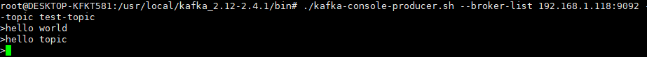

# 1、kafka安装与启动

## 1.1、kafka安装

[kafka下载地址]: https://kafka.apache.org/downloads

在以上地址下载kafka安装包，安装完成后传到环境上解压即可。如果没有安装jdk，需要先安装jdk。

 

解压完成后如下

 

## 1.2、kafka配置文件

kafka的配置文件为config/server.properties

主要关注以下配置

| 配置              | 说明                                                  |
| ----------------- | ----------------------------------------------------- |
| broker.id         | kafka服务的id，kafka集群模式下，该id必须唯一          |
| listeners         | kafka服务器监听的地址。PLAINTEXT://192.168.1.118:9092 |
| log.dirs          | kafka日志保持路径。默认为/tmp/kafka-logs              |
| num.partitions    | topic分区数量，默认为1。可通过创建topic时指定         |
| zookeeper.connect | zookeeper地址。                                       |

## 1.3、kafka启动与停止

进入解压目录下的bin目录下，执行以下命令

```shell
# 先启动zookeeper
nohup ./zookeeper-server-start.sh ../config/zookeeper.properties &
# 再启动kafka
./kafka-server-start.sh -daemon ../config/server.properties
# 停止先停止kafka，再停止zookeeper。
kill -9 ${pid}
```

附：

zookeeper与kafka全部启动完成后，可以进入zookeeper中查看kafka节点信息。

```shell
./zookeeper-shell.sh 192.168.1.118:2181
```

 

# 2、kafka基础

## 2.1、kafka中的相关术语

 

| 名称          | 说明                                                         |
| ------------- | ------------------------------------------------------------ |
| Broker        | Kafka集群中的一台或多台服务器统称broker.                     |
| Topic         | Kafka会依据topic对不同的消息进行分类。每条消息都需要指定一个topic。每个topic会在kafka日志目录下生成一个或多个（多partition下）目录用于存放消息内容 |
| Producer      | 消息生产者，向Broker中发送消息的客户端                       |
| Consumer      | 消息消费者，向Broker中读取消息的客户端                       |
| ConsumerGroup | 消费者组，可以并行消费Topic中的partition的消息               |
| Partition     | Topic物理上的分组，一个topic可以分为多个partion,每个partion是一个有序的队列。partion中每条消息都会被分配一个有序的Id(offset) |

## 2.2、Topic

### 2.2.1、创建Topic

使用./kafka-topics.sh并指定以下参数

--create：创建

--zookeeper：指定zookeeper服务地址

--topic：topic名称

--topic：topic名称

--partitions 指定分区大小

--replication-factor 指定备份因子大小

```shell
# 创建topic
./kafka-topics.sh --zookeeper localhost:2181 --create --topic test-topic --partitions 1 --replication-factor 1
```

### 2.2.1、删除Topic

使用./kafka-topics.sh并指定以下参数

--delete：删除

--zookeeper：指定zookeeper服务地址

--topic：topic名称

```shell
# 1、topic删除
./kafka-topics.sh --zookeeper localhost:2181 --delete --topic test-topic 
# 2、topic所在日志目录删除
rm -rf /tmp/logs/kafka-logs/${topicName}
# 3、进入zookeeper客户端，删除zookeeper服务器上保存的topic信息
ls /brokers/topics
rmr /brokers/topics/test-topic
ls /brokers/topics
```

### 2.2.1、查看所有Topic

使用./kafka-topics.sh并指定以下参数

--list：查询

--zookeeper：指定zookeeper服务地址

```shell
./kafka-topics.sh --zookeeper localhost:2181 --list
```

### 2.2.1、查看指定Topic详情

使用./kafka-topics.sh并指定以下参数

--describe：描述详情

--zookeeper：指定zookeeper服务地址

--topic：topic名称

```shell
./kafka-topics.sh --zookeeper localhost:2181 --describe --topic test-topic
# ./kafka-topics.sh --bootstrap-server localhost:9092 --describe --topic test-topic
```

## 2.3、消息生产

使用./kafka-console-producer.sh命令打开一个生产者客户端

--broker-list：指定kafka broker列表（可以是kafka集群）

--topic：指定topic

```shell
# 打开生产者客户端
./kafka-console-producer.sh --broker-list 192.168.1.118:9092 --topic test-topic #kafka_2.12-2.4.1版本
./kafka-console-producer.sh --bootstrap-server 192.168.1.118:9092 --topic test-topic #kafka新版本
# 发送两条消息
>hello world
>hello topic
```

 

## 2.4、消息消费

使用./kafka-console-consumer.sh命令打开一个消费者客户端

--bootstrap-server：指定kafka服务器列表（可以是kafka集群）

--topic：指定topic

```shell
./kafka-console-consumer.sh --bootstrap-server 192.168.1.118:9092 --topic test-topic
```

 

打开消费者客户端后会发现啥也没有，这时再在生产者客户端侧发送一条消息hello consumer，发现消费者客户端会接收到消息并消费掉。

如果打开消费者客户端时指定以下参数

**--from-beginning：从头开始消费**

```shell
./kafka-console-consumer.sh --bootstrap-server 192.168.1.118:9092 --from-beginning --topic test-topic
```

就会消费所有的消息，包括之前的。

 

如果再开启一个消费者客户端，和之前的消费者客户端订阅一样的topic，则两个消费者都可以消费消息（类似多播）


小总结：

使用命令行开启消费者客户端时，如果不指定从头开始消费，那么当前组会按当前topic中最后一条消息的偏移量+1进行消费。

如果指定从头开始消费，当前组会从头开始消费该topic中的消息（重复消费）

消息保存在borker服务器上的日志目录下

```shell
/tmp/kafka-logs/主题-分区/00000000.log
```

同一主题-分区下的消息保存是有顺序，通过offset指定每条消息的顺序。先发送的消息先消费。可通过指定offset消费指定位置的消息

// todo图片

## 2.5、消息类型

### 2.5.1、单播消息

一个消费组订阅一个topic，如果这个**消费组**下有多个消费者，只能有一个消费者能消费该topic中的消息。也就是一个消费组中只能有一个消费者消费topic中的消息

```shell
# 创建生产者
./kafka-console-producer.sh --broker-list 192.168.1.118:9092 --topic test-topic
# 创建带消费组的消费者1，该消费者在testGroup组下
./kafka-console-consumer.sh --bootstrap-server 192.168.1.118:9092 --consumer-property group.id=testGroup --topic test-topic
# 创建带消费组的消费者2，该消费者也在testGroup组下
./kafka-console-consumer.sh --bootstrap-server 192.168.1.118:9092 --consumer-property group.id=testGroup --topic test-topic
```

消费结果：

- 生产者在test-topic中生产一条消息groupHello

  

- 先启动消费者1，消费者1会正常消费groupHello

  

- 再启动消费者2，且生产者再次往test-topic中生产一条消息groupHello1，会发现消费者1不会再消费groupHello1，而后创建的消费者2会消费groupHello1。

  

  

- 此时有两个消费者，分别是消费者1和2。生产者再次往test-topic中生产一条消息groupHello2，消费者1和2中仍然只能有一个能消费groupHello2。

  

  

以上就是单播消息的简单实现。

### 2.5.2、多播消息

不同消费组订阅相同的topic，每个消费组都可以消费topic中的消息，且每个消费组中只能有一个消费者消费。

- 结合已有的消费组testGroup下的两个消费者。再创建消费组testGroup1下的两个消费者。一共是两个消费组，四个消费者。

```shell
# 创建带消费组的消费者1，该消费者在testGroup1组下
./kafka-console-consumer.sh --bootstrap-server 192.168.1.118:9092 --consumer-property group.id=testGroup1 --topic test-topic
# 创建带消费组的消费者2，该消费者也在testGroup1组下
./kafka-console-consumer.sh --bootstrap-server 192.168.1.118:9092 --consumer-property group.id=testGroup1 --topic test-topic
```

- 启动testGroup1下的消费者后，生产者往test-topic中生产一条消息groupHello3。则testGroup下的某一个消费者和testGroup1下的某一个消费者都会消费groupHello3


- 多播实现图：


## 2.6、分区partition

- 分区是将一个topic拆分为多个子topic。每个子topic都有自己的存放消息目录。

  - 如果默认不设置分区，就只有一个topic。存放消息的topic名称为${topic-name}-0
  - 如果设置分区，假设设置了三个分区，就会生成三个存放消息的目录。分别为${topic-name}-0，${topic-name}-1，${topic-name}-2

- 创建带分区的topic，同时需要指定副本replication

  ```shell
  ./kafka-topics.sh --zookeeper 192.168.1.118:2181 --create --topic test-topic --partitions 1 --replication-factor 1
  ```

## 2.7、副本replication

- 副本是所有topic分区的备份。

# 3、kafka消费组

```shell
# 查看当前topic下有哪些消费组
./kafka-consumer-groups.sh --bootstrap-server 192.168.1.118:9092 --list
# 查看某个消费组的详细信息
./kafka-consumer-groups.sh --bootstrap-server 192.168.1.118:9092 --describe --group ${gropuName}
```

> 消费组详细信息查看


- current-offset:当前消息消费的偏移量（最近最后一次消费到哪一条消息）

- log-end-offset:消息总量
- lag：还剩多少消息未消费
- 两个消费组对比


# 4、伪集群搭建

> 复制一份server.properties。修改以下配置

```properties
broker.id=1
listeners=PLAINTEXT://192.168.1.118:9093
log.dirs=/tmp/kafka-logs/9093
```

> 使用当前配置文件启动kafka，启动成功后，kafka集群搭建完成。

 
